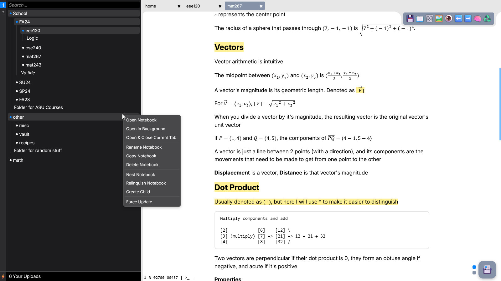

# Note Taking Website

This is my personal note taking website made with vanilla JavaScript. It is a simple open-source, self-hosted note taking application with a minimalistic web interface for creating and organizing notes in Markdown and LaTeX. It's designed to be used with Cloudflare Access.

Technologies:

- Ace Editor
- Micromark
- Express JS
- MongoDB
