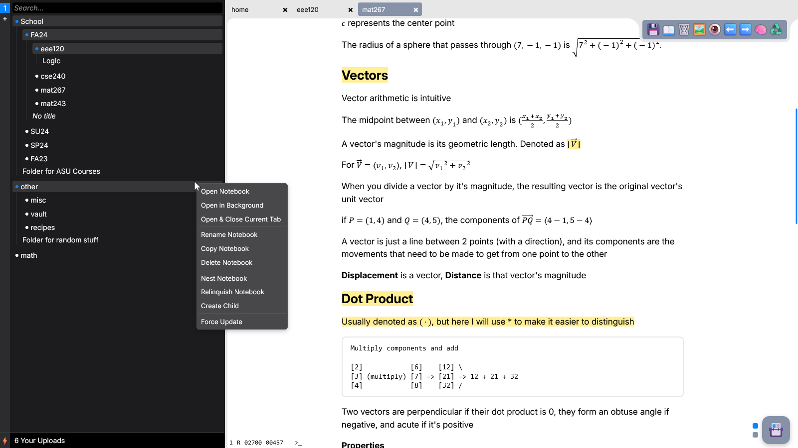

# Note Taking Website

**Deprecated** I no longer use this and instead use Obsidian. This still has some bugs that I can't me bothered to fix.

This is my personal note taking website made with vanilla JavaScript. It is a simple open-source, self-hosted note taking application with a minimalistic web interface for creating and organizing notes in Markdown and LaTeX. It's designed to be used with CloudFlare Access.

Technologies:
- Ace Editor
- Micromark
- Express JS
- MongoDB
