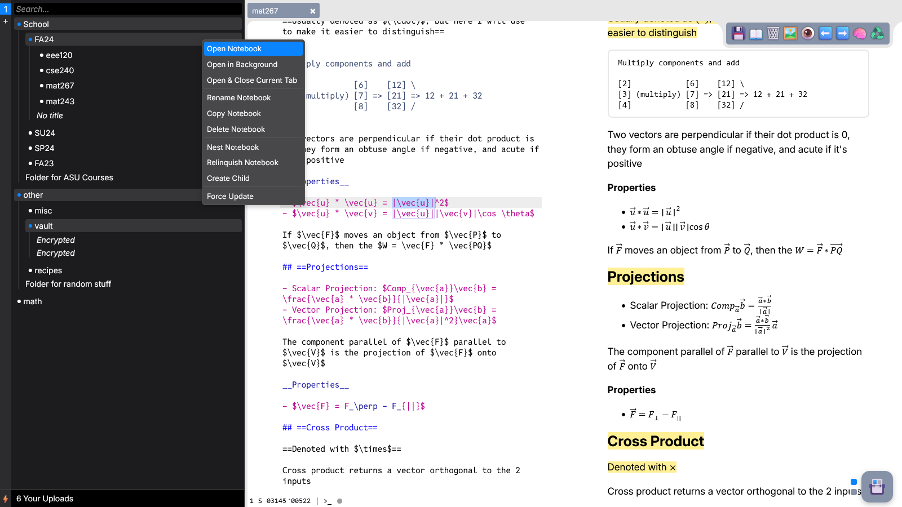

# Note Taking Website

This is my personal note taking website made with vanilla JavaScript. It is a
simple open-source, self-hosted note taking application with a minimalistic web
interface for creating and organizing notes in Markdown and LaTeX. It's designed
to be used with Cloudflare Access.



Technologies:

- Ace Editor
- Micromark
- Express JS
- MongoDB

# Building

1. Install `mongodb` and `npm`
2. Run `npm i`
3. Create environment variables in a `.env` file. You can copy and edit
   `template.env`
4. Run `build.py`. You can pass in a commit message like so if you want to push
   to GitHub

   ```
   python3 build.py "Commit message"
   ```

5. Set up
   [Cloudflare Zero Trust](https://developers.cloudflare.com/cloudflare-one/identity/one-time-pin/)
6. Start `server.js`. I recommend using `deno -P server.js`

If you ever want to rebuild the app, just run `build.py` again without doing all
the other stuff.

If you want to update ace editor, you can delete the `ace-editor` directory in
`public/assets` and run `build.py`

For development, run `npm run dev` or `npm run dev -- --host`
